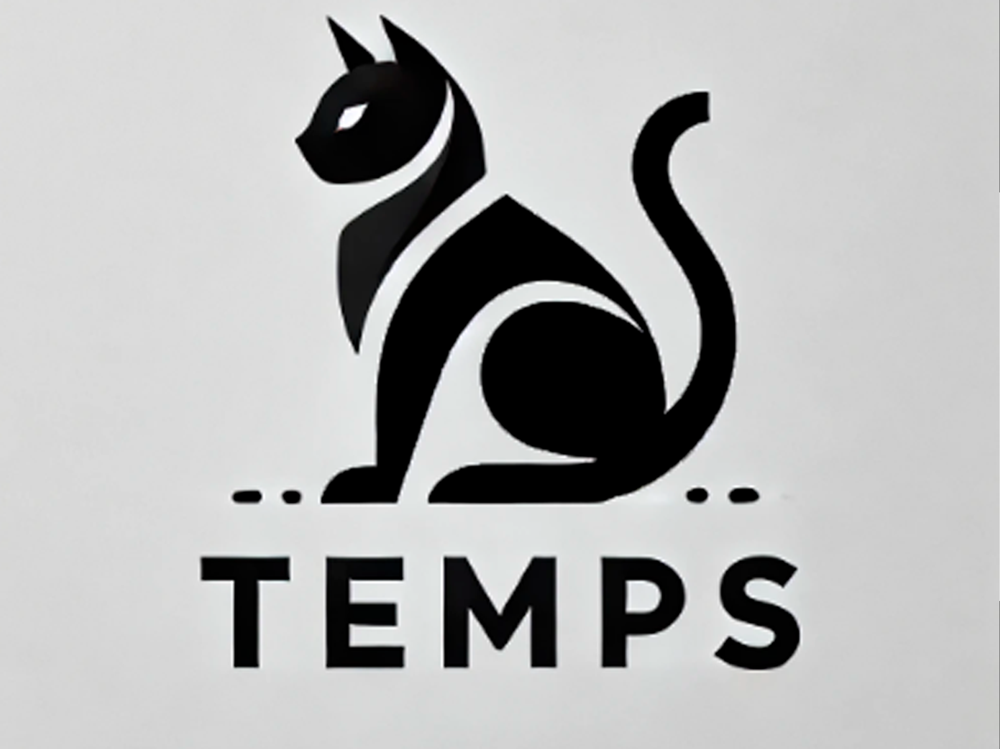

# 🎮 **Jorge Barrera Dorantes** 

---

### 🦅 Sobre Mí
¡Hola! Soy **Jorge**, un apasionado estudiante de **programación de videojuegos**. Disfruto la **competitividad** en los videojuegos y actualmente formo parte de un **equipo de esports**.

☕ Me encanta el **café** y estoy siempre en busca de **nuevas experiencias**. La programación es mi pasión y estoy decidido a seguir aprendiendo y creciendo en este campo.

---

### 🌍 **Ubicación**
**Ecatepec, México**

---

### 💻 **Habilidades**
- **Programación de videojuegos**
- **Unity**
- **Te rifas en LoL** (League of Legends)

---

### 🎓 **Educación**
- Estudiante de programación de videojuegos en **[Nombre de la institución]** (opcional)

---

### 🚀 **Proyectos Destacados**
1. **[Pinwifobia](#)**  
   *Un juego de hordas con pingüinos, donde los jugadores deben sobrevivir a oleadas de enemigos mientras recolectan recursos y mejoran sus habilidades.*

---

### 🍽️ **Experiencia Laboral**
- **Mesero** en **[Nombre del lugar]** (opcional)

---

### 📱 **Redes Sociales**
- [Instagram](#) 
- [Facebook](#) 
- [Discord](#) 

---

### 🎯 **Objetivos Futuros**
- Aprender sobre **desarrollo de juegos en VR** y **realidad aumentada**.
- Contribuir a proyectos de **código abierto** y colaborar con otros desarrolladores.

---

### ✨ **Intereses**
- **Videojuegos competitivos**
- **Tecnología**
- **Innovaciones en desarrollo de juegos**
